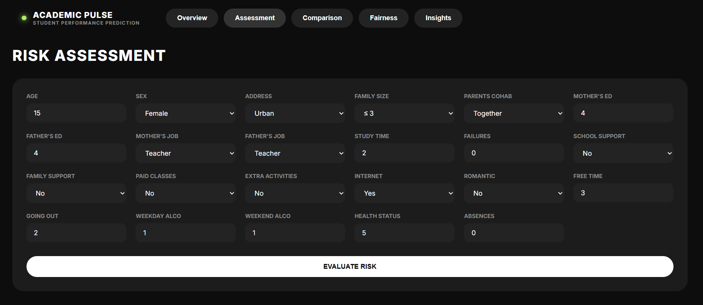

# Student Academic Early Warning System



An end-to-end machine learning decision-support system for identifying students at academic risk before final outcomes are known.

The project goes beyond model accuracy by addressing four practical ML questions:

* How early can academic risk be predicted?
* How much do prior grades improve prediction?
* What is the operational cost of prioritizing recall?
* Does model performance differ across demographic groups?

The system includes reproducible ML training, dual-track experimentation, threshold optimization, fairness evaluation, a FastAPI inference service, an interactive dashboard, automated testing, CI, and Docker support.

---

## Project Overview

Educational institutions may want to identify students who could benefit from academic support before final grades are available.

This project approaches that problem through two separate modeling tracks.

### Early Warning Model

Uses demographic, family, academic-support, attendance, and behavioral features while excluding prior-period grades.

Its purpose is earlier intervention.

### Performance Model

Adds prior-period grades to quantify how much predictive performance improves once stronger academic signals become available.

Its purpose is comparison and analysis rather than early intervention.

This distinction is central to the project: a highly accurate model is not necessarily the most operationally useful model if its strongest features are unavailable at the intended prediction time.

---

## Key Results

### Production Early Warning Model

| Metric              | Held-Out Test Result |
| ------------------- | -------------------: |
| ROC-AUC             |                0.742 |
| PR-AUC              |                0.622 |
| Recall              |                0.846 |
| Precision           |                0.431 |
| F1 Score            |                0.571 |
| False Negative Rate |                0.154 |
| False Positive Rate |                0.547 |

The production model identifies 84.6% of at-risk students in the held-out test set.

This higher recall comes with an important operational tradeoff: a 54.7% false-positive rate. The system is therefore designed as a screening and decision-support tool rather than an automated decision system.

### Prior-Grade Performance Model

| Metric  | Result |
| ------- | -----: |
| ROC-AUC |  0.979 |
| PR-AUC  |  0.962 |

Adding prior grades improved:

* ROC-AUC by 0.237
* PR-AUC by 0.340

The comparison demonstrates the value of prior academic performance while also highlighting temporal availability: prior grades are valid predictors when they exist at prediction time, but inappropriate for a system claiming to operate before those grades are available.

---

## System Architecture

### Online Inference

```mermaid
flowchart LR
    A[Student Input] --> B[Pydantic Validation]
    B --> C[FastAPI Service]
    C --> D[Saved ML Pipeline]
    D --> E[Preprocessing]
    E --> F[Logistic Regression]
    F --> G[Risk Probability]
    G --> H[Metadata Threshold]
    H --> I[Intervention Flag]
    I --> J[Dashboard Response]
```



### Offline ML Workflow

```mermaid
flowchart LR
    A[Raw Dataset] --> B[Validation]
    B --> C[Feature Track Selection]
    C --> D[Stratified Cross-Validation]
    D --> E[Model Comparison]
    E --> F[Controlled Tuning]
    F --> G[Threshold Selection]
    G --> H[Held-Out Evaluation]
    H --> I[Fairness Audit]
    I --> J[Production Artifact]
```



---

## Dataset

The project uses the UCI Student Performance dataset.

| Property                           | Value                                      |
| ---------------------------------- | ------------------------------------------ |
| Samples used in primary experiment | 395                                        |
| Target type                        | Binary classification                      |
| Positive class                     | At Risk                                    |
| Risk definition                    | Final grade below configured threshold     |
| Default grade threshold            | 10                                         |
| Missing values observed            | None                                       |
| Primary challenge                  | Small dataset and moderate class imbalance |

Features cover:

* demographics
* family context
* academic support
* study behavior
* attendance
* lifestyle indicators
* prior grades for the comparison track only

The relatively small dataset is a major limitation. Results should be treated as experimental evidence rather than proof of real-world performance across educational institutions.

---

## Modeling Strategy

Four candidate models were evaluated:

* Dummy Classifier
* Logistic Regression
* Random Forest
* HistGradientBoostingClassifier

Model comparison used stratified 5-fold cross-validation.

The Early Warning cross-validation results were:

| Model                | ROC-AUC | PR-AUC | Recall | Precision |    F1 |
| -------------------- | ------: | -----: | -----: | --------: | ----: |
| Dummy Classifier     |   0.500 |  0.329 |  0.000 |     0.000 | 0.000 |
| Logistic Regression  |   0.651 |  0.505 |  0.507 |     0.484 | 0.493 |
| Random Forest        |   0.654 |  0.494 |  0.224 |     0.618 | 0.332 |
| HistGradientBoosting |   0.637 |  0.443 |  0.403 |     0.463 | 0.430 |

Logistic Regression was selected because it provided the strongest overall balance of PR-AUC, recall, stability, and interpretability for the early-warning use case.

Controlled hyperparameter tuning selected:

```text
Model: Logistic Regression
C: 0.01
Class Weight: balanced
Decision Threshold: ~0.445
```

The exact operational threshold used by the API is loaded from the saved model metadata rather than hardcoded in inference logic.

---

## Threshold Strategy

The default probability threshold of 0.50 was not automatically accepted.

Threshold selection was performed without using the final held-out test set. Candidate thresholds were evaluated with emphasis on achieving at least 75% recall for the at-risk class while considering the resulting intervention workload.

The selected operating point achieved:

* Recall: 84.6%
* False Negative Rate: 15.4%
* False Positive Rate: 54.7%

This is an intentional model-design tradeoff.

A school with limited intervention capacity could choose a different threshold, but that decision would require explicit analysis of available counselor capacity and the relative cost of false negatives and false positives.

---

## Leakage and Temporal Availability

The project explicitly separates two questions.

### Can risk be predicted early?

The Early Warning Model excludes:

```text
grade_period1
grade_period2
final_grade
```

### How much predictive power becomes available later?

The Performance Model includes prior-period grades but still excludes the final target grade.

Prior grades are not inherently data leakage. They become temporal or use-case leakage only when a model claims to make predictions before those grades would actually be available.

This distinction motivated the dual-model experiment.

---

## Explainability

Global model behavior was analyzed using permutation importance.

The strongest Early Warning features included:

| Feature             | Permutation Importance |
| ------------------- | ---------------------: |
| Previous failures   |                  0.182 |
| Going out frequency |                  0.047 |
| Age                 |                  0.010 |
| Family support      |                  0.008 |
| Health status       |                  0.007 |

These values describe predictive associations within this dataset.

They do not establish that any feature causes poor academic performance.

The deployed interface currently presents validated global insights rather than unsupported per-student SHAP explanations.

---

## Fairness Audit

The selected Early Warning Model was evaluated across:

* sex groups
* urban and rural address groups

Observed results showed similar recall across sex groups:

* Female recall: 83.3%
* Male recall: 85.7%

The rural subgroup showed a higher observed false-positive rate than the urban subgroup.

However, the rural test subgroup contained only 19 samples. The result is therefore treated as a monitoring signal rather than evidence of systematic bias.

The project intentionally avoids reducing fairness evaluation to a single “fair” or “biased” label.

Detailed results are available in:

```text
reports/fairness_metrics.csv
reports/fairness_report.md
```

---

## API

The application exposes a FastAPI inference service.

| Method | Endpoint         | Purpose                         |
| ------ | ---------------- | ------------------------------- |
| GET    | `/health`        | Application and model readiness |
| GET    | `/model/info`    | Production model metadata       |
| POST   | `/predict`       | Single-student risk assessment  |
| POST   | `/predict/batch` | Batch risk assessment           |

### Example Request

```json
{
  "age": 15,
  "sex": "F",
  "address": "U",
  "family_size": "GT3",
  "parents_cohabitation": "T",
  "mother_education": 4,
  "father_education": 4,
  "mother_job": "teacher",
  "father_job": "teacher",
  "study_time": 4,
  "failures": 0,
  "school_support": "yes",
  "family_support": "yes",
  "paid_classes": "yes",
  "extra_activities": "yes",
  "internet_access": "yes",
  "romantic_relationship": "no",
  "free_time": 3,
  "going_out": 2,
  "weekday_alcohol": 1,
  "weekend_alcohol": 1,
  "health_status": 5,
  "absences": 0
}
```

### Example Response

```json
{
  "predicted_class": 1,
  "risk_probability": 0.584,
  "probability_percentage": "58.4%",
  "decision_threshold": 0.445,
  "risk_tier": "High",
  "model_version": "early_warning_model",
  "decision_message": "The model indicates elevated academic risk based on the available early-warning features."
}
```

Risk tiers shown in the interface are presentation aids derived relative to the operational threshold. They are not independently validated outcome categories.

The binary intervention flag remains the model's actual decision rule.

---

## Decision-Support Dashboard

The application includes a lightweight Single Page Application served directly by FastAPI.

The dashboard contains five sections:

1. **System Overview** — production metrics and operating tradeoffs.
2. **Student Risk Assessment** — validated interactive prediction form.
3. **Model Comparison** — Early Warning versus prior-grade model analysis.
4. **Fairness Audit** — subgroup performance comparison with sample-size context.
5. **Model Insights** — global feature importance and interpretation guidance.

The frontend uses vanilla HTML, CSS, and JavaScript and communicates directly with the FastAPI inference endpoints.

---

## Repository Structure

```text
student-early-warning/
├── .github/workflows/
├── api/
├── app/static/
├── configs/
├── data/
├── models/
├── notebooks/
├── reports/
├── scripts/
├── src/
│   ├── data/
│   ├── evaluation/
│   ├── features/
│   └── models/
├── tests/
├── Dockerfile
├── requirements.txt
├── requirements-dev.txt
└── README.md
```

---

## Testing

The project contains 15 automated tests covering:

* data ingestion
* schema validation
* numerical range validation
* target construction
* preprocessing consistency
* prior-grade exclusion
* API request validation
* invalid category rejection
* model artifact loading
* prediction probability validation
* threshold application
* API-to-model inference consistency

Run the complete suite:

```bash
python -m pytest -v
```

Current local result:

```text
15 passed
0 failed
```

---

## Continuous Integration

The repository includes a GitHub Actions workflow that runs on configured push and pull-request events.

The workflow:

1. checks out the repository
2. configures Python 3.10
3. installs project dependencies
4. performs import smoke checks
5. executes the complete test suite

Remote CI status should be verified from the repository's Actions page after pushing the project.

---

## Docker

The application can run as a single container containing:

* FastAPI backend
* static dashboard
* model pipeline
* model metadata

### Build

```bash
docker build -t student-early-warning:latest .
```

### Run

```bash
docker run -p 8000:8000 student-early-warning:latest
```

Open the application at:

```text
http://127.0.0.1:8000
```

The container runs the application without development reload mode and uses a non-root application user.

---

## Local Development

### 1. Create an environment

```bash
python -m venv venv
```

Windows:

```bash
venv\Scripts\activate
```

macOS/Linux:

```bash
source venv/bin/activate
```

### 2. Install dependencies

```bash
pip install -r requirements-dev.txt
```

### 3. Run tests

```bash
python -m pytest -v
```

### 4. Start the application

```bash
python -m uvicorn api.main:app --host 127.0.0.1 --port 8000
```

---

## Responsible Use

This system is an experimental decision-support application.

It should not be used to:

* automatically penalize students
* deny academic opportunities
* replace educator or counselor judgment
* make high-impact decisions from model output alone

Risk probabilities represent statistical model estimates, not certainty.

Any real deployment would require external validation, local performance evaluation, subgroup monitoring, privacy controls, and clearly defined intervention policies.

---

## Limitations

The primary limitations are:

* only 395 samples in the primary experiment
* limited evidence of generalization across schools or regions
* high false-positive rate at the selected high-recall threshold
* small subgroup sample sizes in fairness evaluation
* complete input fields currently required
* no prospective real-world validation
* no causal interpretation of model features
* no production drift monitoring
* no authenticated user or student-data access control

---

## Future Work

Future development should focus on validation and operational reliability rather than adding unnecessary model complexity:

* external validation across additional institutions
* temporal validation across academic years
* probability calibration analysis
* missing-data handling strategy
* intervention-capacity-aware threshold optimization
* confidence intervals for subgroup metrics
* model and data drift monitoring
* authenticated counselor workflows
* privacy-preserving student data management

---

## Project Status

**ML Pipeline:** Complete
**API:** Complete
**Dashboard:** Complete
**Automated Tests:** 15 passing locally
**Docker:** Locally validated
**Deployment:** Deployment-ready; no public deployment currently claimed
